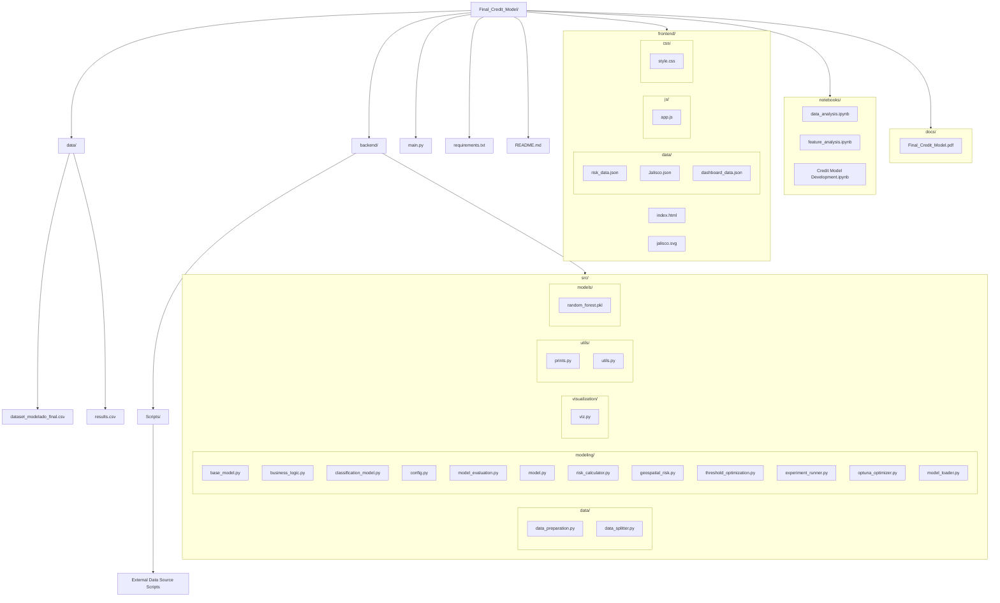

# ML Credit Decision Engine
### Credit Models — ITESO Universidad Jesuita de Guadalajara

**Authors:**
- José Armando Melchor Soto — 745697
- Rolando Fortanell Canedo — 744872
- David Campos Ambriz — 7444435

**Course:** Credit Models  
**Institution:** ITESO Universidad Jesuita de Guadalajara  
**Date:** May 13, 2026

---

## Table of Contents

- [Overview](#overview)
- [Architecture](#architecture)
  - [Project Structure](#project-structure)
  - [OOP Architecture](#oop-architecture)
  - [System Architecture](#system-architecture)
- [Methodology](#methodology)
  - [Data & Sources](#data--sources)
  - [Feature Engineering](#feature-engineering)
  - [Preprocessing](#preprocessing)
  - [Feature Selection](#feature-selection)
- [Model](#model)
  - [Model Benchmarking](#model-benchmarking)
  - [Final Model Selection](#final-model-selection)
  - [Credit Rate Construction](#credit-rate-construction)
- [Results](#results)
  - [Model Performance](#model-performance)
  - [Risk Segmentation](#risk-segmentation)
  - [Financial Projections](#financial-projections)
- [Deployment](#deployment)
- [Limitations & Future Improvements](#limitations--future-improvements)
- [Installation](#installation)
- [Usage](#usage)
- [Output](#output)
- [Documentation](#documentation)
- [License](#license)

---

## Overview

Mexico received **USD 64.745 billion** in remittances during 2024 — a record high after eleven years of growth. Jalisco ranked as the **third largest recipient state**, capturing USD 5.503 billion (8.5% of the national total). Despite the magnitude and regularity of these flows, the households that receive them remain excluded from formal credit markets. Nearly 90% of remittances arrive via electronic transfer and are deposited directly into bank accounts, generating a verifiable, recurring, and traceable income record that the credit system still ignores.

This project develops a **comprehensive credit scoring system** designed to address this gap by creating a home improvement loan or mortgage product for remittance-receiving households in Jalisco, with:

- Loan amounts between **MXN 50,000 and 500,000**
- Terms of **5 to 15 years**
- Payments via **automatic debit** from the remittance-receiving account

The core proposition is that the **temporal pattern of remittance flows over a 24-month period** can serve as a substitute for credit history to predict repayment capacity and probability of default.

The dataset consists of **10,000 synthetic household records**, each calibrated against official sources including Banxico, CONAPO, INEGI, CNBV, CEMLA, BBVA Research, and IIEG Jalisco. The model achieves a **ROC-AUC of 0.7872** on the test set, with risk-adjusted interest rates ranging from **28.25% to 47.90%** — substantially below the 100–300%+ implicit cost of informal financing available to this segment.

---

## Architecture

### Project Structure



### OOP Architecture

```mermaid
classDiagram

%% =====================================================
%% ABSTRACT BASE MODEL
%% =====================================================

class BaseModel {
    <<abstract>>

    +train(X, y)
    +predict(X)
    +predict_proba(X)
}

%% =====================================================
%% CLASSIFICATION MODEL
%% =====================================================

class ClassificationModel {
    -model_name : str
    -config : dict
    -model : object

    +train(X, y)
    +predict(X)
    +predict_proba(X)
    +save_model(filename, models_dir)
    +load_model(filename, models_dir)
}

BaseModel <|-- ClassificationModel

%% =====================================================
%% FACTORY
%% =====================================================

class Model {
    +get_model(task_type, model_name, y_train)
}

Model --> ClassificationModel

%% =====================================================
%% DATA LAYER
%% =====================================================

class DataPreparation {
    -data : DataFrame
    +prepare_data()
}

class DataSplitter {
    -test_size : float
    -random_state : int
    +split(X, y)
}

%% =====================================================
%% RISK LAYER
%% =====================================================

class RiskCalculator {
    -lgd : float

    +calculate_pd(model, X)
    +calculate_ead(data)
    +calculate_lgd(data)
    +calculate_expected_loss(pd, lgd, ead)
}

class BusinessLogic {
    -threshold : float
    -LGD : float

    +credit_decision(pd_values)
    +risk_buckets(pd_values)
    +calculate_interest_rate(pd_values)
}

class GeospatialRisk {
    +build_municipality_risk(data)
}

%% =====================================================
%% EVALUATION
%% =====================================================

class ModelEvaluation {
    -task_type : str

    +evaluate(y_true, y_pred, y_pred_proba)
    +evaluate_full(...)
}

class ThresholdOptimizer {
    -y_true
    -y_prob

    +optimize_threshold(n_trials)
}

%% =====================================================
%% OPTUNA
%% =====================================================

class OptunaOptimizer {
    -model_name
    -param_space

    +_sample_params(trial)
    +objective(trial)
    +optimize(n_trials)
}

%% =====================================================
%% EXPERIMENTS
%% =====================================================

class ExperimentRunner {
    -data
    -model_names

    +optimize_model(model_name)
    +run()
}

%% =====================================================
%% PIPELINE
%% =====================================================

class CreditPipeline {
    -data
    -model_name
    -model_version

    +train_and_evaluate()
    +run()
}

%% =====================================================
%% VISUALIZATION
%% =====================================================

class Visualization {

    +plot_roc_curve()
    +plot_confusion_matrix()
    +plot_scatter()
    +plot_bar()
    +plot_distribution()
    +plot_boxplot()
    +plot_probability_density()
    +plot_real_vs_predicted_pd()
    +plot_calibration_curve()
    +plot_all()
    +export_dashboard_data()
}

%% =====================================================
%% LOADER
%% =====================================================

class ModelLoader {
    +load_model(model_version)
}

%% =====================================================
%% RELATIONSHIPS
%% =====================================================

CreditPipeline --> DataPreparation
CreditPipeline --> DataSplitter
CreditPipeline --> Model
CreditPipeline --> RiskCalculator
CreditPipeline --> BusinessLogic
CreditPipeline --> GeospatialRisk
CreditPipeline --> ModelEvaluation
CreditPipeline --> ThresholdOptimizer
CreditPipeline --> ModelLoader

ExperimentRunner --> CreditPipeline
ExperimentRunner --> OptunaOptimizer

OptunaOptimizer --> Model
OptunaOptimizer --> ModelEvaluation

Visualization --> GeospatialRisk
```



### System Architecture

```mermaid
flowchart LR

%% =====================================================
%% DATA LAYER
%% =====================================================

subgraph DL["Data Layer"]
    style DL fill:#2b2b2b,stroke:#7f8c8d,stroke-width:2,color:#ffffff

    A1["Load Dataset<br/>dataset_modelado_final.csv"]
    A2["Data Preparation<br/>Feature Engineering<br/>Encoding"]
    A3["DataSplitter<br/>Train / Test Split"]

    style A1 fill:#3d5a60,stroke:#cfd8dc,color:#ffffff
    style A2 fill:#3d5a60,stroke:#cfd8dc,color:#ffffff
    style A3 fill:#3d5a60,stroke:#cfd8dc,color:#ffffff

    A1 --> A2 --> A3
end

%% =====================================================
%% BENCHMARKING
%% =====================================================

subgraph BM["Benchmarking & Optimization"]
    style BM fill:#3a3a3a,stroke:#7f8c8d,stroke-width:2,color:#ffffff

    B1["ExperimentRunner"]
    B2["Optuna Optimization"]
    B3["MLflow Tracking"]
    B4["Best Model Selection"]

    style B1 fill:#5a5a5a,stroke:#dfe6e9,color:#ffffff
    style B2 fill:#5a5a5a,stroke:#dfe6e9,color:#ffffff
    style B3 fill:#5a5a5a,stroke:#dfe6e9,color:#ffffff
    style B4 fill:#5a5a5a,stroke:#dfe6e9,color:#ffffff

    B1 --> B2 --> B3 --> B4
end

%% =====================================================
%% MODELING LAYER
%% =====================================================

subgraph ML["Modeling Layer"]
    style ML fill:#3b312c,stroke:#b08968,stroke-width:2,color:#ffffff

    M1["Model Factory"]
    M2["ClassificationModel<br/>(RF / XGBoost / LightGBM / Logistic)"]
    M3["Model Training"]
    M4["Predict Probability of Default"]
    M5["Threshold Optimization<br/>(Optuna)"]
    M6["Model Evaluation<br/>ROC-AUC / F1 / Recall"]

    style M1 fill:#6d4c41,stroke:#d7ccc8,color:#ffffff
    style M2 fill:#6d4c41,stroke:#d7ccc8,color:#ffffff
    style M3 fill:#6d4c41,stroke:#d7ccc8,color:#ffffff
    style M4 fill:#6d4c41,stroke:#d7ccc8,color:#ffffff
    style M5 fill:#6d4c41,stroke:#d7ccc8,color:#ffffff
    style M6 fill:#6d4c41,stroke:#d7ccc8,color:#ffffff

    M1 --> M2 --> M3 --> M4 --> M5 --> M6
end

%% =====================================================
%% RISK ENGINE
%% =====================================================

subgraph RE["Risk Engine"]
    style RE fill:#2f4f3e,stroke:#81c784,stroke-width:2,color:#ffffff

    R1["RiskCalculator"]
    R2["Probability of Default (PD)"]
    R3["Loss Given Default (LGD)"]
    R4["Exposure at Default (EAD)"]
    R5["Expected Loss (EL)"]

    style R1 fill:#4e7d63,stroke:#c8e6c9,color:#ffffff
    style R2 fill:#4e7d63,stroke:#c8e6c9,color:#ffffff
    style R3 fill:#4e7d63,stroke:#c8e6c9,color:#ffffff
    style R4 fill:#4e7d63,stroke:#c8e6c9,color:#ffffff
    style R5 fill:#4e7d63,stroke:#c8e6c9,color:#ffffff

    R1 --> R2 --> R3 --> R4 --> R5
end

%% =====================================================
%% BUSINESS LOGIC
%% =====================================================

subgraph BL["Business Logic"]
    style BL fill:#4b4030,stroke:#d4a373,stroke-width:2,color:#ffffff

    BL1["Credit Decision"]
    BL2["Risk Segmentation"]
    BL3["Interest Rate Calculation"]

    style BL1 fill:#7f6745,stroke:#ffe0b2,color:#ffffff
    style BL2 fill:#7f6745,stroke:#ffe0b2,color:#ffffff
    style BL3 fill:#7f6745,stroke:#ffe0b2,color:#ffffff

    BL1 --> BL2 --> BL3
end

%% =====================================================
%% GEOSPATIAL ANALYTICS
%% =====================================================

subgraph GA["Geospatial Analytics"]
    style GA fill:#5a5247,stroke:#bcaaa4,stroke-width:2,color:#ffffff

    G1["Municipality Risk Aggregation"]
    G2["Generate risk_data.json"]

    style G1 fill:#8d6e63,stroke:#efebe9,color:#ffffff
    style G2 fill:#8d6e63,stroke:#efebe9,color:#ffffff

    G1 --> G2
end

%% =====================================================
%% VISUALIZATION
%% =====================================================

subgraph VL["Visualization Layer"]
    style VL fill:#394867,stroke:#90caf9,stroke-width:2,color:#ffffff

    V1["ROC Curve"]
    V2["Confusion Matrix"]
    V3["Calibration Curve"]
    V4["PD Distribution"]
    V5["Risk Bucket Analysis"]
    V6["Export dashboard_data.json"]

    style V1 fill:#5c6bc0,stroke:#e3f2fd,color:#ffffff
    style V2 fill:#5c6bc0,stroke:#e3f2fd,color:#ffffff
    style V3 fill:#5c6bc0,stroke:#e3f2fd,color:#ffffff
    style V4 fill:#5c6bc0,stroke:#e3f2fd,color:#ffffff
    style V5 fill:#5c6bc0,stroke:#e3f2fd,color:#ffffff
    style V6 fill:#5c6bc0,stroke:#e3f2fd,color:#ffffff

    V1 --> V2 --> V3 --> V4 --> V5 --> V6
end

%% =====================================================
%% FRONTEND
%% =====================================================

subgraph FE["Frontend Dashboard"]
    style FE fill:#40314f,stroke:#ce93d8,stroke-width:2,color:#ffffff

    F1["Interactive Risk Dashboard"]
    F2["Geospatial Risk Map"]
    F3["Credit Risk Metrics"]

    style F1 fill:#7e57c2,stroke:#f3e5f5,color:#ffffff
    style F2 fill:#7e57c2,stroke:#f3e5f5,color:#ffffff
    style F3 fill:#7e57c2,stroke:#f3e5f5,color:#ffffff

    F1 --> F2 --> F3
end

%% =====================================================
%% CONNECTIONS
%% =====================================================

A3 --> ML
BM --> ML
ML --> RE
RE --> BL
BL --> GA
ML --> VL
GA --> FE
VL --> FE

linkStyle default stroke:#b0bec5,stroke-width:2
```



---

## Methodology

### Data & Sources

Since individual transactional remittance data per household are not publicly available, a **high-fidelity synthetic dataset** of 10,000 household records was constructed and calibrated against ten official sources:

| Source | Data | Main Use |
|---|---|---|
| Banxico, SIE | Monthly domestic remittances (SE27803) | Chow-Lin indicator |
| Banxico, SIE | Quarterly remittances by municipality (CE166) | Regional Score Target |
| Banxico, Inf. Operativa | Housing portfolio delinquency | Default rate calibration |
| CONAPO | Migration Intensity Index 2020 (DP2) | Pillar C — Migration Context |
| CONAPO | Municipal Marginalization Index 2020 | Pillar C — Socioeconomic context |
| INEGI, 2020 Census | Municipal ITER Indicators | Pillar C — Municipality characteristics |
| CNBV | Delinquency rate by portfolio type | Target default rate calibration |
| IIEG Jalisco | Remittances and Migration Intensity | Cross-validation of State figures |
| BBVA Research | 2024 Migration and Remittances Yearbook | Calibration of census distributions |
| CEMLA | Demographic characteristics of recipient households | Calibration of census distributions |

**Temporal Disaggregation — Chow-Lin Method**

Quarterly municipal data from Banxico's CE166 series were disaggregated to monthly frequency using the Chow-Lin (1971) method:

$$y_t = \beta_0 + \beta_1 x_t + u_t, \quad u_t \sim AR(1)$$

where $y_t$ is the unobserved monthly municipal series, $x_t$ is the observable national monthly indicator (SE27803), and $u_t$ is a first-order autoregressive residual. The result: 17,856 observations across 124 municipalities over 144 months, with a maximum aggregation error on the order of $10^{-10}$ million USD and seasonal correlation with the national series of **r = 0.9842**.

### Feature Engineering

The 27 predictor variables are organized into three analytical pillars:

**Pillar A — Temporal Pattern of Remittance Flow (12 features)**

Computed over a 24-month window (Jan 2023 – Dec 2024) simulated individually per household, using a multiplicative model:

$$\text{remittances}_{i,t} = M_i \cdot s(\text{month}_t) \cdot \varepsilon_{i,t} \cdot \mathbf{1}_{\text{transfer}_{i,t}}$$

Features include: median and mean remittance amount, standard deviation, coefficient of variation, normalized 24-month trend slope, seasonal strength, months without remittances, maximum consecutive gap, flow age in months, proposed loan installment, and remittance-to-installment ratio.

**Pillar B — Demographic Characteristics (6 features)**

Age, female gender indicator, number of dependents, education level (ordinal 0–4), homeownership, and renting indicators. All distributions calibrated against CEMLA, BBVA Research, and INEGI 2020 Census microdata.

**Pillar C — Municipal Socioeconomic Context (9 features)**

Migration Intensity Index DP2, percentage of households receiving remittances and with emigrants, Municipal Marginalization Index, average municipal schooling, percentage of employed population earning up to two minimum wages, and three Regional Score components (total score, payment capacity sub-score, migration intensity sub-score).

**Regional Score**

A composite metric on [0,1] combining municipality-level payment capacity (schooling, income above 2 minimum wages, housing access proxy) and migration exposure (Migration Intensity Index DP2, marginalization, remittance dependency). Median: 0.4852 across the 124 municipalities of Jalisco.

**Target Variable**

`default_12m` — binary indicator of default within 12 months. Default rate: **5.5%**, calibrated against CNBV mortgage portfolio delinquency data and adjusted upward to reflect the higher-risk profile of the target segment (no formal credit history, no explicit mortgage collateral).

### Preprocessing

The preprocessing pipeline, implemented in Python with a modular architecture, performs the following steps:

1. Separation of target variable (`default_12m`) from feature matrix
2. Exclusion of identification variables (`id_hogar`, `cve_municipio`, `municipio`) to prevent leakage
3. One-hot encoding via `pd.get_dummies(drop_first=True)` for categorical features
4. Normalization and feature scaling for remittance-related variables (skewed distributions, heterogeneous scales)
5. Stratified train/test split — **75% train / 25% test** — with `random_state=42` to preserve the 5.5% default class proportion in both partitions

### Feature Selection

Feature selection was guided by three complementary stages:

**Correlation Analysis** — an initial correlation matrix identified highly collinear variables. Variables such as `pa_mediana_remesa`, `pa_desv_remesa`, and `pa_cuota_propuesta_mxn` were excluded due to strong redundancy with other remittance metrics. After reduction, pairwise correlations across remaining features confirmed low to moderate multicollinearity.

**XGBoost Feature Importance (gain)** — trained with `n_estimators=300`, `max_depth=3`, `learning_rate=0.01`, `subsample=0.8`, `colsample_bytree=0.8`, `scale_pos_weight` adjusted for class imbalance. Top predictors by gain: `pa_n_meses_sin_envio`, `pa_ratio_remesa_cuota`, `pa_max_racha_sin_envio`, `pc_score_regional`, `pb_n_dependientes`.

**SHAP Analysis** — Shapley Additive Explanations decomposed predictions to reveal directional effects. Higher `pa_ratio_remesa_cuota` pushes predictions toward non-default; higher `pa_n_meses_sin_envio` and `pa_max_racha_sin_envio` push toward default. Regional indicators (`pc_score_regional`, `pc_sub_capacidad_pago`) showed meaningful directional influence consistent with financial theory.

**Final Selected Features (16 variables):**

| Category | Variables |
|---|---|
| Remittance Stability & Repayment Capacity | `pa_media_remesa`, `pa_cv_remesa`, `pa_ratio_remesa_cuota` |
| Remittance Behavioral Patterns | `pa_pendiente_norm`, `pa_n_meses_sin_envio`, `pa_max_racha_sin_envio`, `pa_fuerza_estacional`, `pa_antiguedad_meses` |
| Household Sociodemographics | `pb_edad`, `pb_genero_F`, `pb_n_dependientes`, `pb_escolaridad_ord`, `pb_vivienda_propia` |
| Regional Socioeconomic | `pc_score_regional`, `pc_sub_capacidad_pago` |

---

## Model

### Model Benchmarking

Four candidate algorithms were evaluated under a unified experimental environment using the same preprocessing pipeline, feature set, and train/test split. Hyperparameter optimization was performed with **Optuna** (objective: ROC-AUC); experiments were tracked with **MLflow**.

| Model | Interpretability | Training Speed | Non-Linearity | Imbalanced Data Handling | Deployment Complexity |
|---|---|---|---|---|---|
| Logistic Regression | High | Very Fast | Low | Medium | Low |
| Random Forest | Medium | Medium | High | High | Medium |
| XGBoost | Medium | Slow | Very High | Very High | High |
| LightGBM | Medium | Fast | Very High | Very High | Medium |

**Benchmark results across versions:**

| Model Version | ROC-AUC | Precision | Recall | F1-Score |
|---|---|---|---|---|
| logistic_v1 | 0.786 | 0.2335 | 0.3841 | 0.2904 |
| random_forest_v1 | 0.7774 | 0.1863 | 0.4348 | 0.2609 |
| xgboost_v1 | 0.7724 | 0.1663 | 0.5580 | 0.2562 |
| lightgbm_v1 | 0.7739 | 0.1739 | 0.4348 | 0.2484 |
| **logistic_v2** | **0.7872** | **0.2374** | **0.3768** | **0.2913** |
| random_forest_v2 | 0.7785 | 0.2035 | 0.4203 | 0.2742 |
| xgboost_v2 | 0.7681 | 0.1718 | 0.5217 | 0.2585 |
| lightgbm_v2 | 0.7633 | 0.1830 | 0.4203 | 0.2549 |

### Final Model Selection

**`logistic_v2`** was selected as the final deployment candidate based on its superior balance of ROC-AUC, F1-score, probability calibration consistency, generalization stability (train AUC 0.78 / test AUC 0.79), and operational interpretability — a critical requirement in regulated credit environments.

**Final hyperparameter configuration:**

| Parameter | Value | Description |
|---|---|---|
| `C` | 5.8442 | Regularization strength controlling model complexity |
| `optimal_threshold` | 0.7244 | Probability threshold optimized via Optuna to maximize classification balance |

**Final performance metrics on the test set:**

| Metric | Value |
|---|---|
| Test ROC-AUC | 0.79 |
| Train ROC-AUC | 0.78 |
| Accuracy | 89.9% |
| Precision | 23.7% |
| Recall | 37.7% |
| F1-Score | 29.1% |

### Credit Rate Construction

The interest rate follows a **six-component risk-based pricing** structure:

$$\text{Rate}_{\text{customer}} = r_f + s_{\text{anchorage}} + (PD \cdot LGD) + c_{\text{operat}} + c_{\text{capital}} + m$$

| Component | Value | Description |
|---|---|---|
| $r_f$ — Risk-free rate | 6.9971% | 28-day TIIE as of May 8, 2026 (Banxico) |
| $s_{\text{anchorage}}$ — Funding spread | 3.00% | Midpoint of 200–400 bps range for home improvement SOFOMEs |
| $PD \cdot LGD$ — Credit risk premium | Segment-dependent | LGD calibrated at 45%; PD from model output |
| $c_{\text{operat}}$ — Operating costs | 3.50% | Origination (0.80%) + Administration (2.00%) + Collection (0.30%) + AML/CFT (0.40%) |
| $c_{\text{capital}}$ — Regulatory capital cost | 1.89% | $w_{\text{risk}} \cdot k_{\text{min}} \cdot ROE_{\text{obj}} = 1.0 \times 0.105 \times 0.18$ (Basel III) |
| $m$ — Profit margin | 1.50% | Covers unexpected loss variance and growth reserves |

**Risk-adjusted rates by segment:**

| Risk Bucket | Mean PD | LGD | Premium (PD·LGD) | Final Rate |
|---|---|---|---|---|
| Low Risk | 0.1981 | 0.45 | 0.0891 | **28.25% ± 3%** |
| Medium Risk | 0.4782 | 0.45 | 0.2152 | **37.70% ± 3%** |
| High Risk | 0.7644 | 0.45 | 0.3439 | **47.90% ± 3%** |

These rates are substantially below the implicit cost of informal financing available to this segment (100–300%+ annually) and above conventional mortgage APRs (14.13%), consistent with the product's structural differences from traditional secured lending.

**Credit policy by segment:**

| Risk Bucket | Final Rate | Max Amount (MXN) | Max Term | Decision |
|---|---|---|---|---|
| Low Risk | 28.25% | 500,000 | 15 years | Automatic approval |
| Medium Risk | 37.70% | 300,000 | 10 years | Approval with verification |
| High Risk | 47.90% | 100,000 | 5 years | Conditional approval or rejection |

---

## Results

### Model Performance

The expected loss follows the standard credit risk formulation:

$$EL = PD \cdot LGD \cdot EAD$$

where EAD is estimated using the proposed borrower installment as a proxy for annualized exposure. Both PD and EAD are borrower-specific; LGD is fixed at 45%.

Risk bucket analysis confirmed that predicted PD, expected loss, and modeled interest rates increase monotonically and coherently across Low → Medium → High risk categories, demonstrating that the framework captures financially meaningful risk patterns rather than arbitrary statistical groupings.

### Risk Segmentation

Applicant pool distribution in the deployed model:

| Segment | Pool Share | Credit Decision |
|---|---|---|
| Low Risk | 7.23% | Automatic approval |
| Medium Risk | 85.66% | Approval with verification |
| High Risk | 7.11% | Conditional or rejected |

Overall approval rate: **92.89%** — applicants who under a traditional system would have been rejected solely due to the absence of a formal credit history.

### Financial Projections

Three-year projection for an ENR SOFOM originating 500 loans in Year 1 (30% annual growth), average loan MXN 200,000, portfolio mix of 40% Low / 50% Medium / 10% High Risk:

| Indicator | Year 1 | Year 2 | Year 3 | Reference |
|---|---|---|---|---|
| Gross Portfolio (MXN M) | 92 | 196 | 320.9 | — |
| Interest Income (MXN M) | 16.0 | 51.0 | 90.2 | — |
| Net Income (MXN) | 558,888 | 14.2 M | 29.8 M | — |
| ROE | 5.40% | 80.3% | 75.20% | Target: 18% |
| ROA | 1.30% | 10.1% | 11.40% | SOFOMEs MX: 0.5–4.5% |
| IMOR (NPL Ratio) | 3.00% | 3.00% | 3.00% | CNBV Housing 2024: 3% |
| ICAP | 11.50% | 12.6% | 17.00% | Basel III min: 10.5% |
| Coverage Ratio | 1.30x | 1.30x | 1.30x | SOFOMEs MX: 0.8x–2.1x |

Capital recovery period: **1.67 years**. All 13 financial validation checks satisfied, including positive NPV and equity IRR exceeding the cost of capital.

---

## Deployment

The model is deployed as a web-based analytical platform via **Vercel**, integrating two main components:

**Interactive Geospatial Dashboard** — visualizes municipality-level credit risk across Jalisco's 124 municipalities, displaying predicted PD, risk bucket classification, expected loss, approval rates, and geographic borrower segmentation. Built with HTML/CSS frontend and Python backend; geospatial layer uses municipality polygon JSON files (scalable to other Mexican states).

**ML Monitoring & Analytics Dashboard** — centralizes ROC-AUC behavior, confusion matrices, probability distributions, and risk segmentation analytics generated through the MLflow experimentation pipeline.

---

## Limitations & Future Improvements

**Principal limitations:**

The dataset is synthetic. The 10,000-household registry was calibrated against official aggregate statistics rather than individual transaction records, meaning the model has not been validated against real household-level default outcomes and has not been exposed to real-world transaction noise (irregular schedules, exchange rate volatility, sender-specific seasonal distortions, idiosyncratic shocks).

The Chow-Lin disaggregation produces monthly municipal estimates, not observations. While the aggregation constraint is satisfied with virtually zero error and seasonal correlation reaches r = 0.9842, estimation variance at the municipal level for low-volume municipalities is not captured by the quarterly validation exercise.

The financial projections assume a static macroeconomic environment — a consequential assumption given that Mexico recorded its first annual decline in remittances since 2013 in 2025 (−4.6% nationally, −10% in Jalisco), driven by U.S. immigration enforcement tightening and the proposed federal tax on international transfers. A sustained remittance contraction would simultaneously erode repayment capacity and reduce the collateral quality underpinning the product's risk structure.

The LGD of 45% has no direct empirical basis for this specific product type, as no comparable lending program has operated at scale.

**Priority improvements for future iterations:**

Incorporation of real transactional data from a remittance operator active in Jalisco — even a limited sample would allow synthetic distribution validation and genuine behavioral retraining. Dynamic repricing via a variable-rate clause linked to TIIE fluctuations would protect net interest margin in declining rate environments. Geographic expansion to Michoacán, Guanajuato, and Oaxaca is supported by the modular pipeline architecture without structural redesign. Integration of champion-challenger testing and Population Stability Index (PSI) tracking into the MLflow environment would enable proactive model drift detection as the portfolio matures.

---

## Installation

```bash
# 1. Clone the repository
git clone https://github.com/ppmelch/Final_Credit_Model.git
cd Final_Credit_Model

# 2. Create and activate a virtual environment
python -m venv .venv
source .venv/bin/activate      # macOS / Linux
.venv\Scripts\activate         # Windows

# 3. Install dependencies
pip install -r requirements.txt
```

---

## Usage

```bash
python main.py
```

The pipeline will automatically execute data preparation, feature engineering, model training with Optuna hyperparameter optimization, evaluation, risk calculations, business logic, geospatial aggregation, and dashboard data export.

---

## Output

Running `main.py` produces the following outputs:

- `data/results.csv` — borrower-level predictions including PD, risk bucket, EAD, LGD, EL, and modeled interest rate
- `frontend/data/risk_data.json` — municipality-level aggregated risk metrics for the geospatial dashboard
- `frontend/data/dashboard_data.json` — model evaluation metrics and distribution data for the ML analytics dashboard
- `backend/src/models/random_forest.pkl` — serialized trained model artifact (versioned via MLflow)
- MLflow experiment logs — full parameter, metric, and artifact tracking for all evaluated configurations

---

## Documentation

The full project report is available at:

- [Credit Model Report](docs/Final_Credit_Model.pdf)
- [GitHub Repository](https://github.com/ppmelch/Final_Credit_Model)

---

## License

This project is licensed under the **MIT License** — see [LICENSE](LICENSE) for details.
