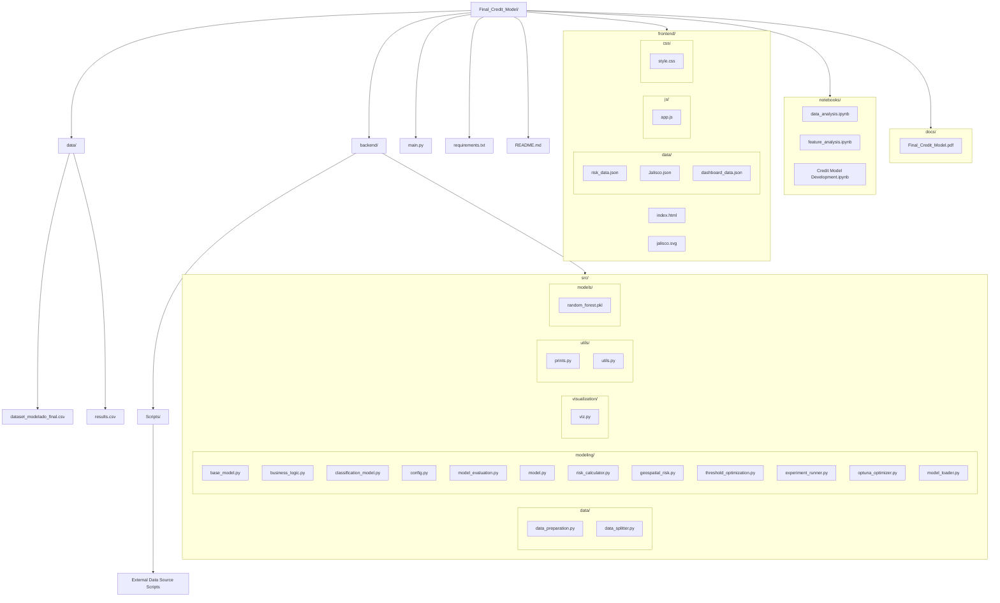

# Final Credit Model
### Credit Models project

**Authors:**
- José Armando Melchor Soto — 745697
- Rolando Fortanell Canedo — 744872
- David Campos Ambriz — 7444435
 
**Course:** Credit Models

**Institution:** ITESO Universidad Jesuita de Guadalajara

**Date:** May 13, 2026
 
---
 
## Table of Contents

---
 
## Overview
 

---
 
## Architecture
 
### Project Structure
 

 
### Functional Architecture
 
```mermaid

```
 
### OOP Architecture
 
```mermaid
classDiagram

%% =====================================================
%% ABSTRACT BASE MODEL
%% =====================================================

class BaseModel {
    <<abstract>>

    +train(X, y)
    +predict(X)
    +predict_proba(X)
}

%% =====================================================
%% CLASSIFICATION MODEL
%% =====================================================

class ClassificationModel {
    -model_name : str
    -config : dict
    -model : object

    +train(X, y)
    +predict(X)
    +predict_proba(X)
    +save_model(filename, models_dir)
    +load_model(filename, models_dir)
}

BaseModel <|-- ClassificationModel

%% =====================================================
%% FACTORY
%% =====================================================

class Model {
    +get_model(task_type, model_name, y_train)
}

Model --> ClassificationModel

%% =====================================================
%% DATA LAYER
%% =====================================================

class DataPreparation {
    -data : DataFrame
    +prepare_data()
}

class DataSplitter {
    -test_size : float
    -random_state : int
    +split(X, y)
}

%% =====================================================
%% RISK LAYER
%% =====================================================

class RiskCalculator {
    -lgd : float

    +calculate_pd(model, X)
    +calculate_ead(data)
    +calculate_lgd(data)
    +calculate_expected_loss(pd, lgd, ead)
}

class BusinessLogic {
    -threshold : float
    -LGD : float

    +credit_decision(pd_values)
    +risk_buckets(pd_values)
    +calculate_interest_rate(pd_values)
}

class GeospatialRisk {
    +build_municipality_risk(data)
}

%% =====================================================
%% EVALUATION
%% =====================================================

class ModelEvaluation {
    -task_type : str

    +evaluate(y_true, y_pred, y_pred_proba)
    +evaluate_full(...)
}

class ThresholdOptimizer {
    -y_true
    -y_prob

    +optimize_threshold(n_trials)
}

%% =====================================================
%% OPTUNA
%% =====================================================

class OptunaOptimizer {
    -model_name
    -param_space

    +_sample_params(trial)
    +objective(trial)
    +optimize(n_trials)
}

%% =====================================================
%% EXPERIMENTS
%% =====================================================

class ExperimentRunner {
    -data
    -model_names

    +optimize_model(model_name)
    +run()
}

%% =====================================================
%% PIPELINE
%% =====================================================

class CreditPipeline {
    -data
    -model_name
    -model_version

    +train_and_evaluate()
    +run()
}

%% =====================================================
%% VISUALIZATION
%% =====================================================

class Visualization {

    +plot_roc_curve()
    +plot_confusion_matrix()
    +plot_scatter()
    +plot_bar()
    +plot_distribution()
    +plot_boxplot()
    +plot_probability_density()
    +plot_real_vs_predicted_pd()
    +plot_calibration_curve()
    +plot_all()
    +export_dashboard_data()
}

%% =====================================================
%% LOADER
%% =====================================================

class ModelLoader {
    +load_model(model_version)
}

%% =====================================================
%% RELATIONSHIPS
%% =====================================================

CreditPipeline --> DataPreparation
CreditPipeline --> DataSplitter
CreditPipeline --> Model
CreditPipeline --> RiskCalculator
CreditPipeline --> BusinessLogic
CreditPipeline --> GeospatialRisk
CreditPipeline --> ModelEvaluation
CreditPipeline --> ThresholdOptimizer
CreditPipeline --> ModelLoader

ExperimentRunner --> CreditPipeline
ExperimentRunner --> OptunaOptimizer

OptunaOptimizer --> Model
OptunaOptimizer --> ModelEvaluation

Visualization --> GeospatialRisk

```
 

 

---
 
## Methodology

 

### Model
 
 
---
 
## Results
 
### Model Performance

### Key Findings
 


---
 
## Limitations & Assumptions
 
### Future Improvements
 

---
 
## Conclusions
 

---
 
## Installation
 
```bash
# 1. Clone the repository
git clone https://github.com/ppmelch/Final_Credit_Model.git
cd Credit_Model
 
# 2. Create and activate a virtual environment
python -m venv .venv
source .venv/bin/activate      # macOS / Linux
.venv\Scripts\activate         # Windows
 
# 3. Install dependencies
pip install -r requirements.txt
```
 
---
 
## Usage
 
```bash
python main.py
```
 
---
 
## Output
 

---
 
## Documentation
 
The full project report is available at:
 
- [Credit Model Report](docs/Final_Credit_Model.pdf)
 
---
 
## License
 
This project is licensed under the **MIT License** — see [LICENSE](LICENSE) for details.
